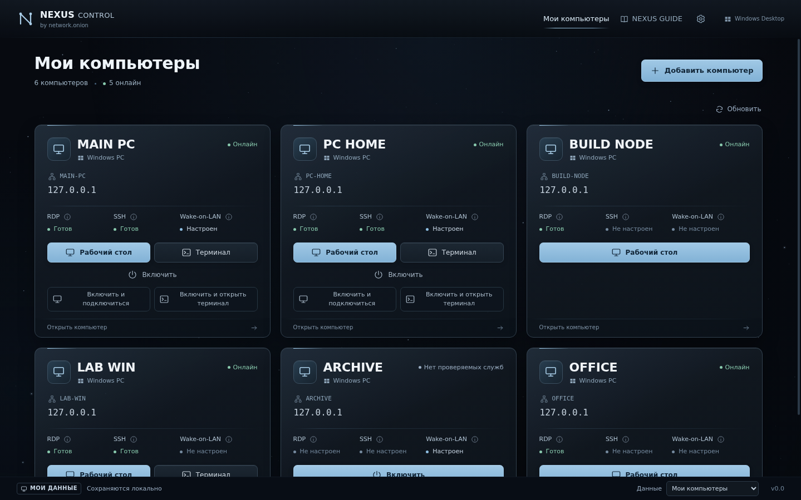
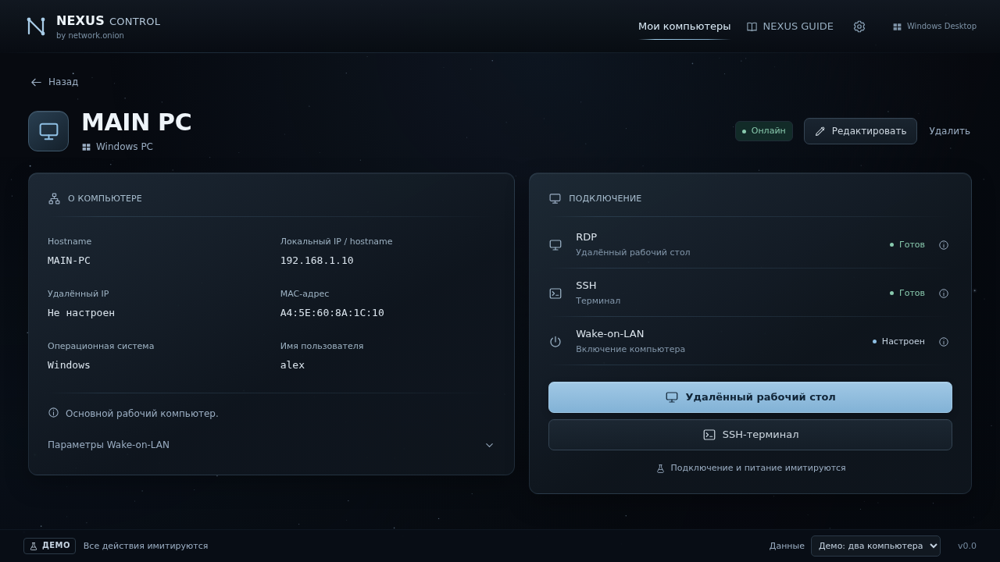
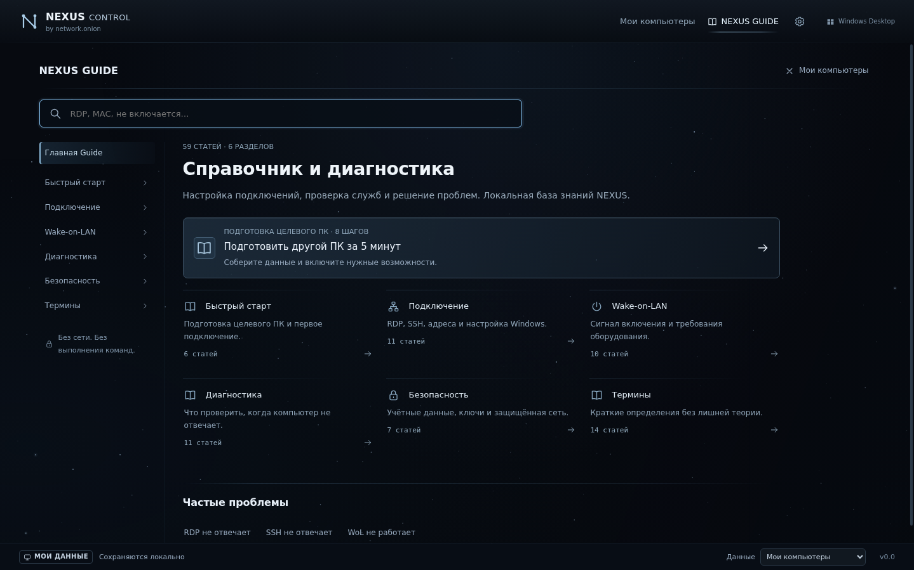
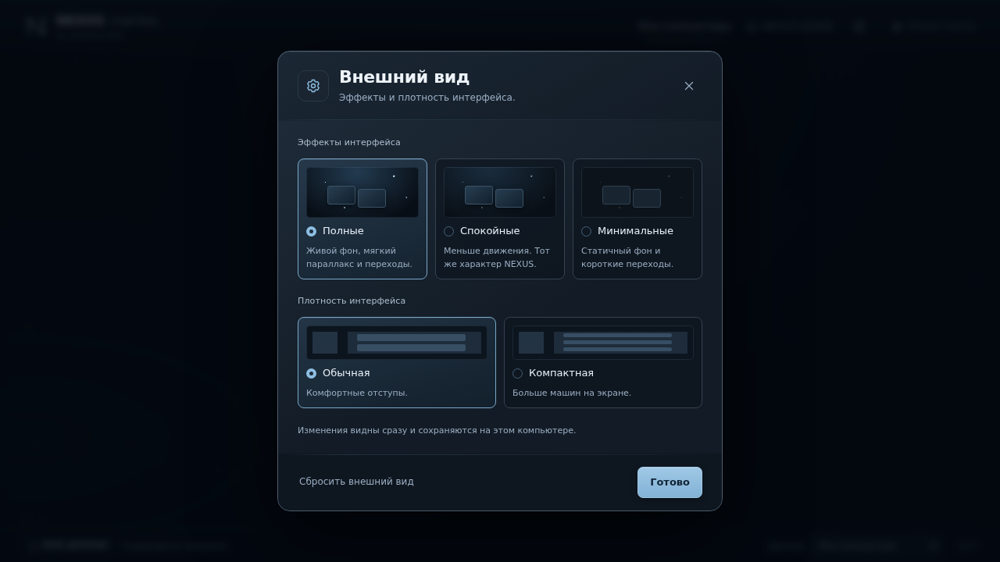

# NEXUS CONTROL

**Все мои компьютеры — в одном месте.**

by **network.onion** · Windows desktop · `1.0.0-rc.1`

NEXUS CONTROL — настольный центр управления собственными компьютерами. Сохраните устройства в одном списке, проверьте доступность нужной службы, откройте удалённый рабочий стол или SSH-терминал, отправьте Wake-on-LAN. Если компьютер выключен, используйте готовое действие: **включить → дождаться доступности → подключиться**.

Приложение подходит для рабочего ПК, домашнего компьютера, Windows-сервера или лаборатории с несколькими устройствами. Особенно полезно тем, кто уже использует RDP, SSH и WoL и хочет быстрее переключаться между компьютерами.



*Интерфейс стабильной базы Stage12. На изображении — тестовые записи и адреса loopback.*

## Что становится проще

| Задача | Как помогает NEXUS CONTROL |
|---|---|
| Регулярно подключаться к нескольким ПК | Названия, адреса и возможности сохранены в карточках; нужное действие рядом с устройством. |
| Понять, доступен ли RDP или SSH | Приложение проверяет соответствующие TCP-порты и показывает результат отдельно для каждой службы. |
| Подключаться из локальной сети или через VPN | Сначала проверяет локальный адрес, затем сохранённый удалённый адрес для той же службы. |
| Включить компьютер и дождаться подключения | Отправляет WoL, ждёт выбранную службу и открывает клиент, когда она становится доступна. |
| Быстро разобраться с настройкой или ошибкой | Встроенный NEXUS GUIDE содержит краткие инструкции, диагностику и локальный поиск, доступные без интернета. |

Например: вам нужен рабочий стол домашнего ПК, который сейчас выключен. В его карточке нажмите **«Включить и подключиться»**. NEXUS отправит Magic Packet, будет ждать RDP до 90 секунд и откроет стандартный клиент Windows. Вам остаётся пройти обычную авторизацию. Пока идёт ожидание, сценарий можно отменить.

## Возможности

- **Список компьютеров:** добавление, редактирование, удаление, заметки и сохранение между запусками.
- **Сетевые проверки:** RDP/SSH, локальный и удалённый адрес, сведения о результате, отмена проверки.
- **Удалённый рабочий стол:** запуск системного Microsoft RDP-клиента `mstsc`.
- **SSH:** интерактивный системный OpenSSH в Windows Terminal; при отсутствии Terminal — Console Host.
- **Wake-on-LAN:** отправка стандартного Magic Packet по сохранённым MAC, broadcast-адресу и порту.
- **Wake → connect:** два готовых сценария — WoL → ожидание → RDP и WoL → ожидание → SSH.
- **NEXUS GUIDE:** 59 встроенных статей, поиск, checklist и помощь из контекста действия.
- **Внешний вид:** Full / Calm / Minimal, Normal / Compact, процедурный фон и учёт системной настройки уменьшения анимации.
- **DEMO:** знакомство с интерфейсом на демонстрационных данных без подключения к настоящим устройствам.

## Скриншоты

### Карточка компьютера

Адреса, доступность служб и действия RDP, SSH и Wake-on-LAN собраны на одном экране.



### NEXUS GUIDE

Встроенный справочник с поиском, быстрым стартом и диагностикой доступен без интернета.



### Настройки интерфейса

Выберите интенсивность эффектов и плотность карточек под свой экран и привычки.



*Скриншоты принятого интерфейса Stage11–12. Данные демонстрационные или тестовые; версия в нижней панели относится к моменту съёмки. Текущая версия проекта — `1.0.0-rc.1`.*

## Как работает подключение

NEXUS хранит параметры устройств локально. Перед запуском RDP или SSH проверяет доступность службы по сохранённому адресу и передаёт адрес системному клиенту. Учётные данные вводятся в стандартном клиенте.

Wake-on-LAN отправляет пакет в настроенную сеть. В комбинированном сценарии приложение затем ждёт нужную службу и запускает соответствующий клиент. Уже открытые RDP/SSH-сессии работают самостоятельно и сохраняются при закрытии NEXUS.

Значения статусов:

| Сообщение | Что подтверждено |
|---|---|
| Онлайн / служба готова | Настроенный TCP-порт отвечает. Вход и аутентификация ещё не проверены. |
| Недоступен | Настроенные службы не ответили. Причиной может быть сеть, firewall, служба или питание устройства. |
| Magic Packet отправлен | Пакет отправлен; физическое включение зависит от BIOS/UEFI, адаптера и сети. |
| RDP-клиент / SSH-терминал открыт | Клиент запущен; авторизация выполняется в нём. |

Проверки выполняются при загрузке пользовательских данных, после их изменения и по запросу пользователя. Постоянного фонового мониторинга нет.

Исходники текущей версии: [скачать полный проект ZIP](./NEXUS-CONTROL-github-ready.zip).

## Быстрый запуск готового приложения

Текущая сборка для **Windows x64** поставляется архивом `NEXUS-CONTROL-Windows-x64-1.0.0-rc.1.zip`.

1. Распакуйте **весь архив** в новую папку.
2. Запустите `NEXUS CONTROL.exe` внутри распакованной папки.
3. В режиме **«Мои компьютеры»** нажмите **«Добавить компьютер»**.
4. Укажите имя, адрес и нужные возможности, сохраните запись.
5. Обновите статус и выберите действие на карточке.

Для готового приложения Node.js и npm не нужны. Файлы `resources` и остальные файлы сборки должны оставаться рядом с EXE.

**Текущий статус:** release candidate, сборка unsigned. Готовый NSIS installer пока не выпущен; Windows-приложение в ZIP уже собрано. Windows может показать предупреждение SmartScreen/reputation. Подробности и результаты проверок — в [отчёте Stage13](./STAGE13.md).

## Подготовить другой ПК за 5 минут

Если RDP/SSH/WoL уже настроены, достаточно собрать параметры для карточки:

| Поле | Что указать |
|---|---|
| Название | Понятное имя устройства: HOME PC, WORKSTATION, LAB. |
| Локальный адрес | IPv4 или доступное сетевое имя компьютера. |
| Hostname | Имя компьютера; отдельное поле необязательно. |
| Удалённый адрес | При необходимости — адрес в уже настроенном VPN или другой доступной сети. |
| SSH username | Для SSH: `user`, `DOMAIN\user` или `user@domain`. |
| MAC | MAC сетевого адаптера целевого ПК; нужен для WoL. |
| Подсеть / broadcast | Уточните маску и broadcast вашей сети; сохраните broadcast IPv4 в карточке. |
| WoL-порт | Настроенный UDP-порт; обычно 9. |

Для **RDP** на целевом ПК: откройте **Параметры → Система → Удалённый рабочий стол**, включите доступ и разрешите нужного пользователя. Проверьте доступ через сеть и firewall. Windows Pro / Enterprise / Education поддерживают входящие RDP-подключения; Windows Home может выступать клиентом, но не RDP-host. [Инструкция Microsoft](https://learn.microsoft.com/en-us/windows-server/remote/remote-desktop-services/remotepc/remote-desktop-allow-access).

Для **SSH**: на ПК с NEXUS нужен системный OpenSSH Client, на целевом Windows-ПК — настроенный и запущенный OpenSSH Server. Windows Terminal используется при наличии. [Инструкция Microsoft](https://learn.microsoft.com/en-us/windows-server/administration/openssh/openssh_install_firstuse).

Для **WoL**: вручную настройте поддержку пробуждения в BIOS/UEFI и сетевом адаптере. Возможность пробуждения из сна или выключенного состояния зависит от оборудования и сети.

NEXUS использует уже настроенный доступ: RDP — порт **3389**, SSH — **22**. VPN, службы Windows, firewall и BIOS приложение автоматически не настраивает.

## Первый компьютер

1. Выберите **Мои компьютеры**, затем **Добавить компьютер**.
2. Введите название и локальный IPv4 / hostname. При необходимости добавьте удалённый адрес.
3. Включите RDP и/или SSH. Для SSH заполните username.
4. Если нужен WoL, заполните MAC, broadcast IPv4 и порт.
5. Сохраните карточку и нажмите **Обновить**.
6. Используйте **Рабочий стол**, **Терминал**, **Включить** или комбинированное действие.

Пароли в карточке не запрашиваются. DEMO и пользовательские данные разделены: демонстрационные записи не записываются в ваш список.

## Данные и безопасность

Данные приложения находятся в `%APPDATA%\NEXUS CONTROL`. Компьютеры сохраняются в `computers.json`, внешний вид — отдельно в локальном storage интерфейса. Перед ручным изменением файлов закройте приложение и сделайте резервную копию профиля.

В конфигурации installer обычное удаление сохраняет пользовательские данные. Настоящая установка, повторная установка и удаление ещё требуют [проверки на Windows](./WINDOWS-SMOKE-STAGE13.md).

Приложение не хранит пароли и не управляет SSH-ключами. Системные клиенты сохраняют стандартную аутентификацию и проверку host key. Пользовательские адреса, username и заметки остаются локально; telemetry, облачная синхронизация, updater, агент и фоновая служба не добавлены.

Electron работает с `nodeIntegration=false`, `contextIsolation=true`, `sandbox=true` и `webSecurity=true`. Renderer получает ограниченный типизированный IPC-мост; системные действия выполняются в main process. [Архитектура](./ARCHITECTURE.md).

## Запуск из исходников

Нужны **Node.js 24 LTS** (минимум 22.12), npm и интернет для первой установки зависимостей.

Скачайте [полный проект с исходниками](./NEXUS-CONTROL-github-ready.zip), распакуйте архив и откройте терминал в папке `nexus-control` с `package.json`:

```powershell
npm.cmd ci
npm.cmd run dev
```

Откроется окно приложения. Для остановки dev нажмите `Ctrl+C` в терминале. В PowerShell используется `npm.cmd`, чтобы запуск не зависел от разрешения `npm.ps1`.

Проверки и production-запуск:

```powershell
npm.cmd run typecheck
npm.cmd test
npm.cmd run build
npm.cmd start
```

`build` создаёт production-код в `out`; `start` запускает уже собранный код. Для сборки Windows-пакета нужны отдельные команды ниже.

## Собрать Windows-приложение и installer

В терминале Windows x64 после `npm.cmd ci`:

```powershell
# Готовая папка приложения без installer
npm.cmd run pack:win
npm.cmd run verify:package -- --unpacked

# NSIS installer
npm.cmd run dist:win
npm.cmd run verify:package
```

Результаты:

| Команда | Результат |
|---|---|
| `pack:win` | `release\win-unpacked\NEXUS CONTROL.exe` и файлы приложения. |
| `dist:win` | `release\NEXUS-CONTROL-Setup-1.0.0-rc.1.exe` после успешного завершения NSIS. |

Installer настроен для текущего пользователя: ярлык в меню «Пуск», без ярлыка на рабочем столе, без запроса администратора при обычной установке. Эти настройки ещё нужно подтвердить на реальной Windows.

В среде подготовки RC NSIS не завершился: Wine требует запрещённые Unix sockets. Промежуточный EXE исключён из поставки. Финальную сборку и проверку installer выполняйте на Windows по [пошаговому checklist](./WINDOWS-SMOKE-STAGE13.md).

## Проверки и ограничения RC

На текущем этапе прошли:

- Проверка типов и production build.
- **199 unit / packaging tests**.
- **128 групп Electron QA**: storage, network, RDP, SSH, WoL, orchestration, UX, Guide, appearance и readiness.
- **120 сочетаний интерфейса** по эффектам, плотности, размеру окна и экрану.
- Cross-build Windows x64 и статическая проверка PE, ресурсов и ASAR.

Electron QA выполнялся на Linux/Xvfb с изолированными профилями и тестовыми Windows-провайдерами. Это не подтверждает настоящий Windows login, физическое WoL, работу ярлыков, installer/uninstall или DPI на Windows.

Основная платформа проекта — **Windows 10/11 x64**. Linux-провайдеры пока не реализованы. Automations / Scripts, scheduler и универсальное удалённое выполнение команд — будущие направления, описанные в [ROADMAP](./ROADMAP.md).

## Документация

- [Release notes 1.0.0-rc.1](./RELEASE-NOTES-1.0.0-rc.1.md)
- [Отчёт Stage13: packaging, проверки и ограничения](./STAGE13.md)
- [Windows: сборка installer и 16 шагов smoke-проверки](./WINDOWS-SMOKE-STAGE13.md)
- [Windows readiness: диагностика приложения и системных клиентов](./WINDOWS-SMOKE.md)
- [Архитектура](./ARCHITECTURE.md)
- [Направления развития](./ROADMAP.md)

Для сообщения об ошибке укажите версию NEXUS, Windows, действие и ожидаемый/фактический результат. Для ошибок сборки добавьте Node/npm и безопасный фрагмент ошибки. Не прикладывайте пароли, private keys или полный пользовательский профиль.

## Лицензия

В `package.json` указано `UNLICENSED`. Открытая лицензия для проекта пока не выбрана.
